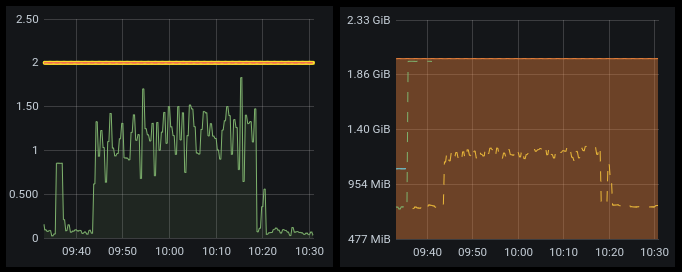
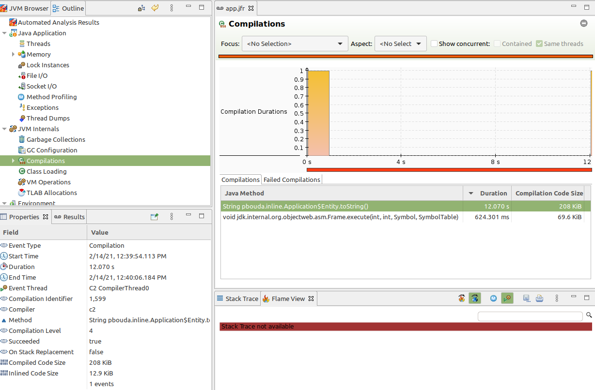
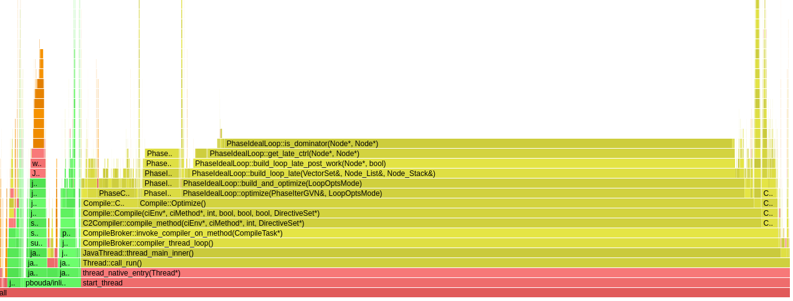
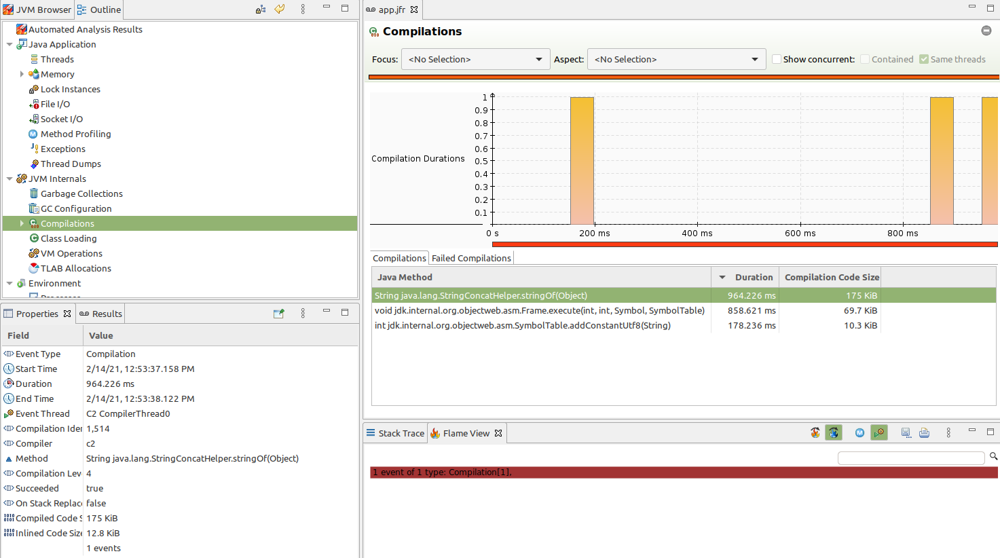
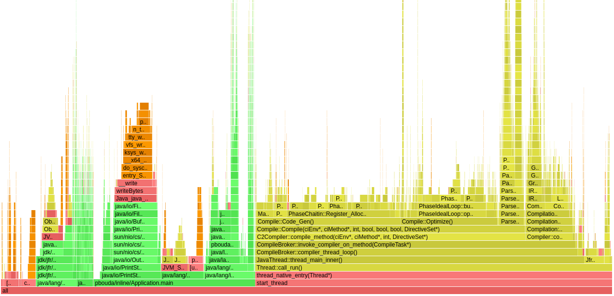
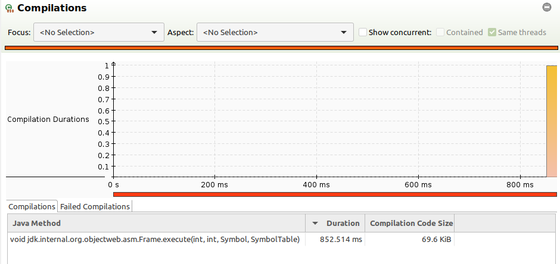
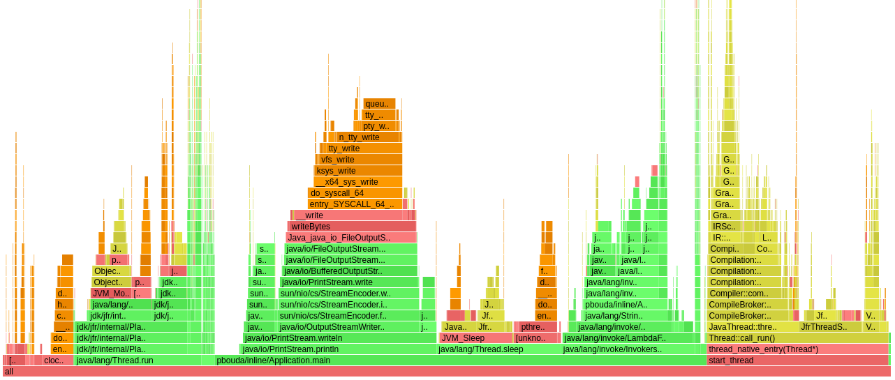
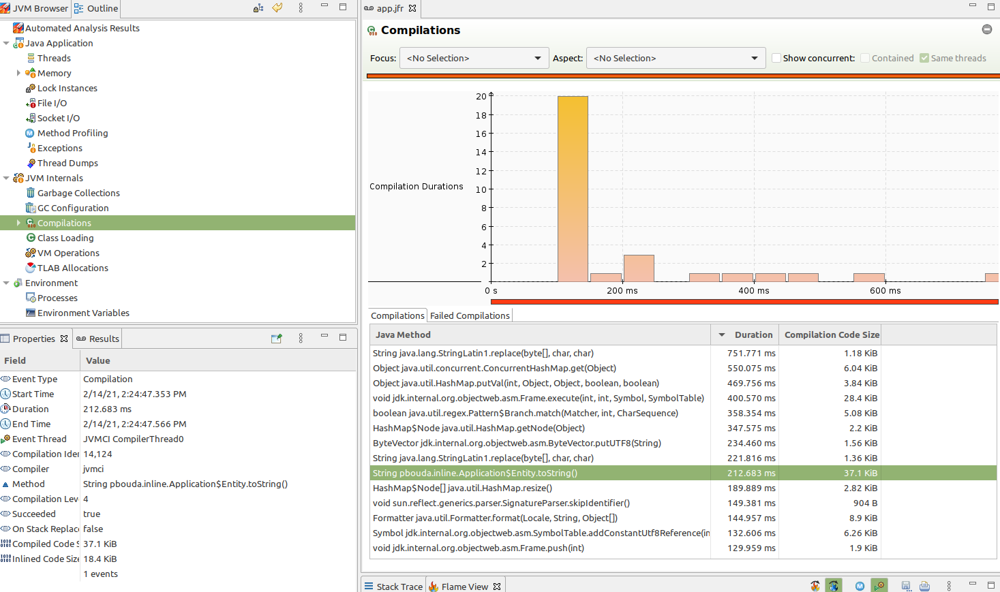
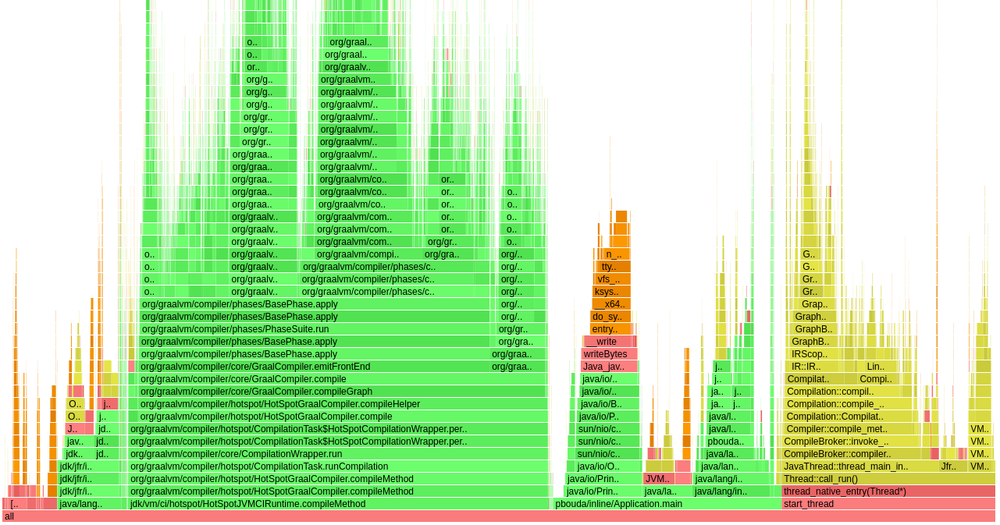

# Hotspot Inlining Issue (compilation time)

#### Problem

My client has a legacy database and wanted to migrate data using CDC (similar to Debezium). Database contains a bigger number of fields 
(cca. 50). Data is send to RabbitMQ and consumed by Java-based app. It's mapped to Java class using types from Standard JDK library:
Integers, Longs, Strings, LocalDates, Instants, BigDecimals, ...

After calling `toString` on this class (and of course, calling `toString` to all its fields), the application was experiencing 
a significant growth of vCPU consumption (a normal load is not such big, something around 5-10% of 1 vCPU) 
and RSS memory growth about 1GB (it runs on Kubernetes). The application itself does not cache anything, 
200MB of Heap and 200MB for native memory should be enough.

It turns out that the problem is in C2 compilation of `toString` method belonging to this entity. 
When the compilation kicks in, it takes 30min of vCPU burst.

- CPU and Memory consumption during the compilation



### Reproducer

I tried to simulate the same situation with a simple reproducer. A smaller number of fields means a lower impact caused by compilation, but
big enough to demonstrate the problem. I noticed that every additional field increases the compilation time exponentially.

#### 20 boxed Integers with one String

- A based image with Debug symbols and AsyncProfiler: 
  https://github.com/petrbouda/openjdk-x-dbg-asyncprofiler
- We can adjust JVM flags in the POM file

- Build an image using JIB Plugin in POM file

```
mvn package
```

- Create and run the container (it automatically dumps JFR on-exit to /tmp/profiler)

```
docker run -it --rm --name app --cpus="1" --memory="1g" --memory-swap="1g" --network host \
-v /var/run/docker.sock:/var/run/docker.sock \
-v /tmp/profiler:/tmp/profiler \
--security-opt seccomp=unconfined \
inlining:latest
```

- Start AsyncProfiler (if you want to have flamegraphs in /tmp/profiler)

```
docker exec -ti app profiler.sh 30 -i 1ms -e cpu -f /tmp/profiler/cpu.html 1
```

- 12-sec long compilation



[flamegraph-with-string.html](flamegraph-with-string.html) (save and open the interactive graph locally)



#### 20 boxed Integers WITHOUT any String (only one type of fields inside the class)

- Remove assigning of String value in `pbouda.inline.Application` and run `mvn package` to update the image

- no `toString` inlining at all, just `StringConcatHelper` used by MethodHandles and InvokeDynamic to concatenate strings.



- it can be caused by a threshold in JFR Compilation events, only 

```
<event name="jdk.Compilation">
  <setting name="enabled" control="compiler-enabled">true</setting>
  <setting name="threshold" control="compiler-compilation-threshold">100 ms</setting>
</event>
```

- no `PhaseIdealLoop` and checking a dominator Node

[flamegraph-without-string.html](flamegraph-without-string.html)



### Possible Fixes

#### Excluded Compilation of `toString` method

- switch the command on in POM: `-XX:CompileCommand=exclude,pbouda.inline.Application$Entity::toString`



- no `PhaseIdealLoop` and checking a dominator Node

[flamegraph-excluded.html](flamegraph-excluded.html)


#### Disable C2 Compilation

In general, we don't want to disable C2 Compilation and run our program intentionally slower in a peak time. However, it's good to know it
exists and have some practice :)

- switch the command on in POM: `-XX:TieredStopAtLevel=1`

[flamegraph-c2-disabled.html](flamegraph-c2-disabled.html)



#### Enable Graal Compiler

Graal Compiler is a replacement for C2 Compiler, and it's currently located in JDK 15. However, it's going to be changed in JDK 16, it will
be removed. That means that, it's just a next experiment :).

- switch the command on in POM: `-XX:+UnlockExperimentalVMOptions -XX:+EnableJVMCI -XX:+UseJVMCICompiler`

- more compilations, however, compilation of our method took ~200ms



- Graal Compiler is implemented in Java and all internal structures are placed in Java Heap as well

[flamegraph-graal.html](flamegraph-graal.html)



### Summary 

I am absolutely aware that concatenating such a big amount of fields is not a good
programming practice :) and having only 1vCPU in JVM-based App does go hand in hand with  
high performance results. however, it's a batch application (RabbitMQ Consumer) 
with not such a strict latency requirements, and I didn't expect such a big impact
from C2 Compiler.

- What is interesting for me (and not answered), why the entire slowdown was caused by 
  having a different field in the class (String does not have any complicated `toString` method).